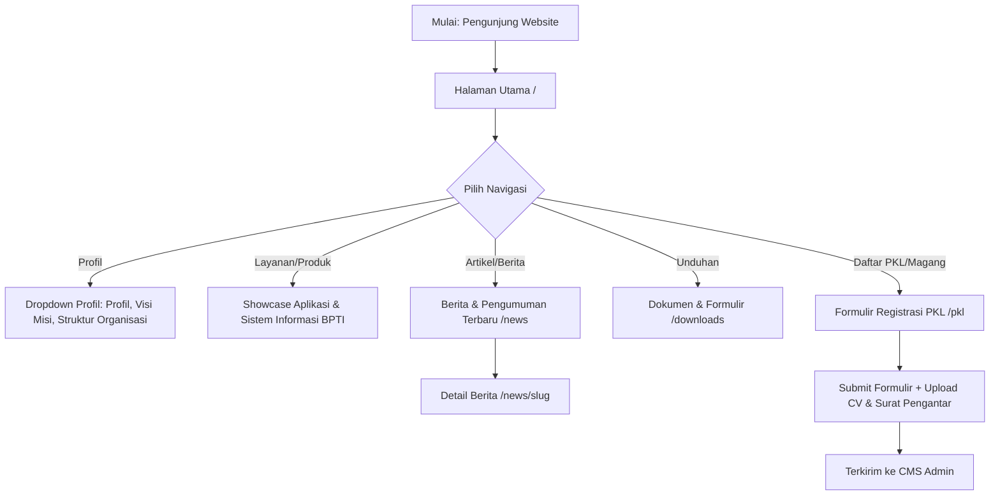
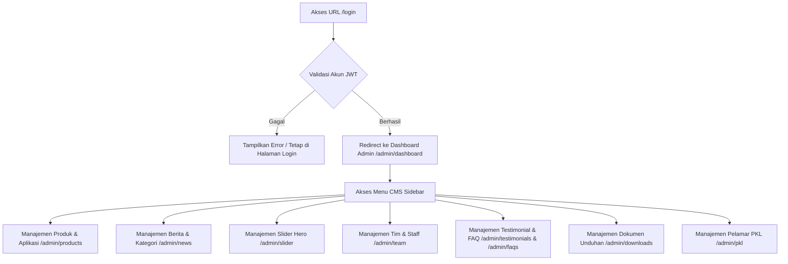

# Progress & Alur Aplikasi BPTI UHAMKA (Laporan Terintegrasi)

Dokumen ini mencatat alur sistem (system flow), status fitur, dan riwayat perkembangan proyek website Badan Pengembangan Teknologi Informasi (BPTI) UHAMKA. Dokumen ini berfungsi sebagai acuan hidup (*living document*) yang akan diperbarui seiring berjalannya progres pengembangan.

---

## 1. Arsitektur Proyek & Teknologi

Proyek ini dibangun menggunakan pemisahan penuh antara Frontend (FE) dan Backend (BE):

*   **Backend (Go/Gin)**: Menyediakan RESTful API, sistem autentikasi JWT, unggah media (gambar & dokumen), dan manajemen basis data menggunakan GORM. Berjalan di `http://localhost:8080`.
*   **Frontend (Next.js 16 - App Router)**: Kerangka kerja UI interaktif berbasis React dengan optimasi Next.js (`next/image`, route grouping, metadata favicon), styling menggunakan **Tailwind CSS v4**, animasi menggunakan **Framer Motion**, dan slider testimonial menggunakan **Swiper.js**. Berjalan di `http://localhost:3000`.

---

## 2. Alur Sistem (Application Flow)

### A. Alur Publik / Guest (Public Flow)

### B. Alur Admin & Manajemen Konten (CMS Flow)

---

## 3. Status Fitur & Progres Pembangunan (Feature Status Checklist)

### A. Halaman Publik & Interaktivitas UI (`src/app/(public)`)
- [x] **Navbar & Brand Header**:
  - Logo resmi BPTI UHAMKA terpasang rapi dengan pemotongan margin putih (*cropped margins*).
  - Jarak menu navigasi diperlebar (`ml-12`) agar tidak menempel pada logo.
  - Dropdown navigasi profil dan bahasa berfungsi.
- [x] **Halaman Utama (Home)**:
  - Hero Section menggunakan gradasi warna premium kontras tinggi (*deep navy blue, emerald green, royal blue*).
  - Apple-style typography untuk Heading dan Subheading.
  - Form pencarian layanan interaktif (pencarian langsung dari database).
  - Bagian statistik aplikasi terintegrasi langsung dengan database backend.
  - Slider Testimonial interaktif menggunakan Swiper.js.
  - FAQ accordion interaktif.
- [x] **Halaman Berita (`/news` & `/news/[slug]`)**:
  - List seluruh berita terbit dengan pencarian.
  - Halaman detail artikel berita lengkap dengan view count counter.
- [x] **Halaman Dokumen Unduhan (`/downloads`)**:
  - Halaman publik menampilkan file panduan/sk/formulir lengkap dengan fitur pencarian dan filter kategori.
- [x] **Pendaftaran PKL/Magang (`/pkl`)**:
  - Formulir pendaftaran pelamar lengkap dengan input file PDF (CV & Surat Pengantar) terintegrasi ke backend.

### B. Portal Administrasi / CMS (`src/app/admin`)
- [x] **Autentikasi & Keamanan JWT**:
  - Akses kontrol admin dilindungi middleware token JWT (otomatis *redirect* ke `/login` jika tidak berwenang).
- [x] **Dashboard Stat & Ringkasan Konten**:
  - Kartu ringkasan jumlah berita, produk aktif, total staff, dan testimonial.
- [x] **CMS Slider Banner**:
  - Kontrol atas gambar slide banner, judul, deskripsi, dan status slide.
- [x] **CMS Aplikasi & Layanan**:
  - CRUD (Create, Read, Update, Delete) portal sistem informasi kampus.
- [x] **CMS Berita & Kategori**:
  - Editor berita lengkap dengan unggahan gambar utama, slug generator, dan pengaturan kategori.
- [x] **CMS Manajemen Tim/Staff**:
  - CRUD struktur anggota organisasi BPTI.
- [x] **CMS Testimonial, FAQ, & Downloads**:
  - CRUD dokumen unduhan, FAQ kampus, dan data testimonial.
- [x] **CMS Pelamar PKL/Magang**:
  - Halaman tinjauan pelamar mahasiswa dengan tombol unduh dokumen PDF CV / Surat Pengantar secara langsung dari cloud/local directory server.

---

## 4. Riwayat Perubahan Terbaru (Recent Activity Log)

| Tanggal | Fitur / Bagian | Deskripsi Perubahan |
| :--- | :--- | :--- |
| **16 Juli 2026** | Inisiasi UI Awal | Setup awal folder Next.js 16, pembuatan halaman admin, dan integrasi API dasar. |
| **16 Juli 2026** | Bugfix Login & Dashboard | Memperbaiki error handling data kosong (`|| []` fallback) dan alur redirect token JWT. |
| **17 Juli 2026** | Refactor Visual Premium | Mengubah skema warna layout menjadi premium kontras tinggi, penataan hero berlayer, & setup Swiper.js. |
| **17 Juli 2026** | Optimasi & SSRF Fix | Menambahkan aturan `unoptimized: true` pada `next.config.ts` untuk mengatasi error upstream image IP lokal. |
| **17 Juli 2026** | Branding & Favicon | Squaring favicon logo UHAMKA menjadi 1:1 bulat sempurna, dan memotong margin putih pada logo Navbar BPTI. |
| **20 Juli 2026** | Pembuatan File Progress | Pembuatan file `APP_PROGRESS_FLOW.md` sebagai log utama proyek. |

---

## 5. Rencana Langkah Selanjutnya (Next Steps)
1. Melakukan testing fungsionalitas pengiriman data (submit form) dan autentikasi token JWT secara menyeluruh.
2. Penyesuaian responsivitas pada perangkat mobile (uji coba layout pada berbagai ukuran viewport).
3. Pengoptimalan kinerja halaman saat memuat gambar backend berukuran besar.
